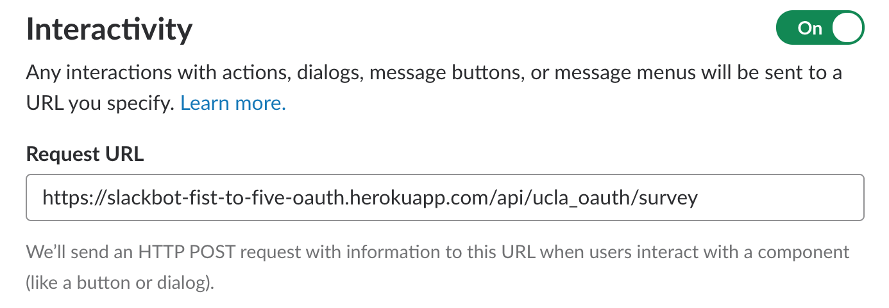
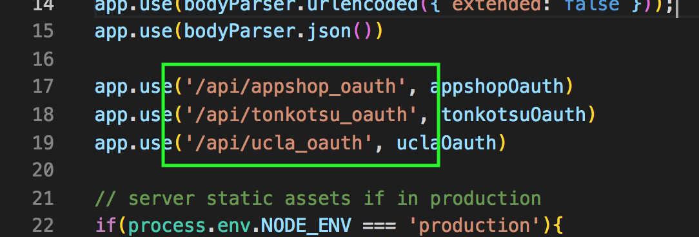
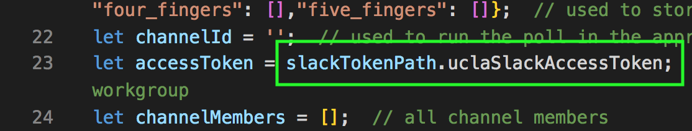
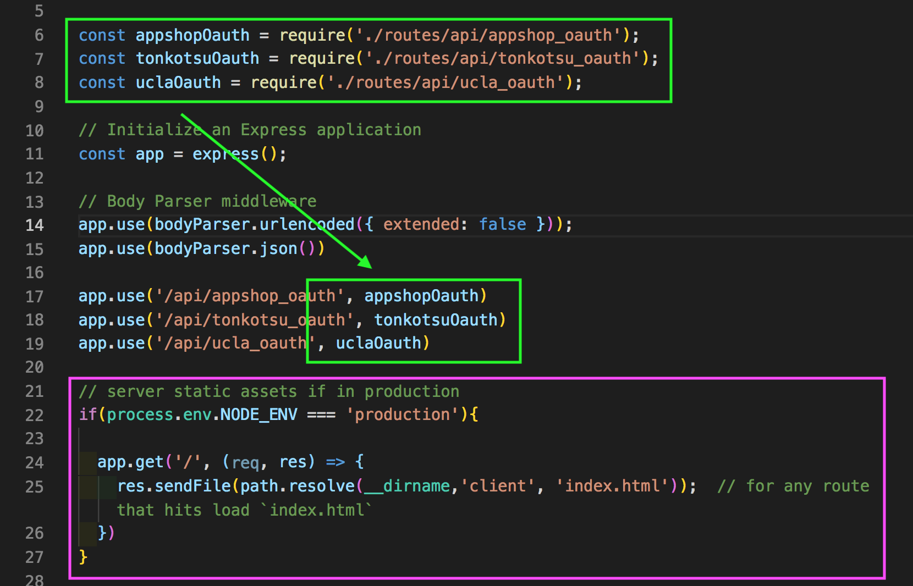

# README &middot; [](#license)  

This application was created to anonymously poll student in class using the fist-to-five technique and a custom Slack slash command. 


The fist-to-five (a.k.a. fist-for-five) technique is used by agile software development teams to poll team members to help achieve consensus or see how well the team is absorbing a topic at hand. For our purpose, we are using it as the latter. Fist to five is similar to thumbs up, thumbs down or thumbs sideways.

Do note that `tonkotsu-oauth.js` makes use of [workspace tokens](https://api.slack.com/docs/token-types#workspace) allowing for a higher level of security as tokens are valid for only 60 minutes. Unfortunately, Slack has stopped issuing any new workspace refresh tokens as this was exclusive to the developer preview community. Nevertheless, workspace refresh tokens are still valid and will continue to work. `ucla-oauth.js` makes use of [User tokens](https://api.slack.com/docs/token-types#user.)

To use, enter `/fist-to-five reset` from within a Slack channel to clear the memory. Then enter, `/fist-to-five` to poll a class. Poll results will be delivered to everyone and continually updated in realtime.

While `ucla-oauth.js` makes use of OAuth 1.0, `tonkotsu-oauth.js` makes use of OAuth 2.0.


I'm always open to suggestions on how to improve this app.

## Table of Contents

- [Installation](#installation)
- [Implementation](#implementation)
- [Technology](#technology)
- [License](#license)

## Installation

To run locally download to your local machine and run the following commands:

```sh
$ npm install
$ nodemon server.js
```
Set up within Slack is still required (i.e. slash command & interactive message).

Hosting on Heroku using the free tier may result in a slight response delay while the server spins up.

<sub>Note to self: command to view the log within Heroku is `heroku logs --source app` or `heroku logs --tail` (realtime).</sub>

## Implementation

To use this within your own Slack workspace the following elements will require attention:

* Hosting. This application is hosted on Heroku using their [free tier](https://www.heroku.com/pricing). Continue using Heroku or any hosting service of your liking.
* Slack Integration. Create a [new app](https://api.slack.com/apps) and develop it in your Slack workspace.
	* Basic Information. Fill in the App Name, Short Description and Background Color.
	* Interactive Components. Turn this on. The Request URL should point back to your server with `/api/custom_name/survey` appended to the end. Swap `custom_name` with a name of your liking and update the route within `server.js`. 

		

	

	* Slash Commands. Create a new command using `/fist-to-five`. The Request URL should point back to your server but with `/api/custom_name` appended to the end. The custom name used here should be the same used in Interactive Components. Give your app a short description and any usage hint(s) (e.g. "Use `/fist-to-five reset` to reset app")
	* OAuth Tokens & Redirect URLs. Include the following Scopes: `channels:read`, `chat:write:bot`, `chat:write:user`, `groups:read`, `im:read`, & `mpim:read`, `commands`. Then click the Install App to Workspace button to reveal your OAuth access token.  
* Keys. Be sure to update the [keys](./config/keys_prod.js) accordingly and update the `slackTokenPath` within the routes file (i.e. slackTokenPath.*uclaSlackAccessToken*).

 

* [server.js](./server.js). Require your file into `server.js` and connect the route. Ignore/remove the code block inside the pink box. 



* `thumb_url`. Within the routes file look for `thumb_url`. There are 3 occurences but only 1 requires updating. If you choose to include a thumbnail image with the message confirmation, update the path. Otherwise it can removed.
* Custom emojis. The the hand emojis used can be found [here](./assets/hand/).

## Technology

Languages, libraries, applications and packages used:

- [JavaScript (ES6)](http://es6-features.org/)
- [Node.js](https://nodejs.org/)
- [Express.js](https://expressjs.com/)
- [Request](https://www.npmjs.com/package/request)

## License

MIT License

Copyright (c) 2018 Mike Yamato

Permission is hereby granted, free of charge, to any person obtaining a copy
of this software and associated documentation files (the "Software"), to deal
in the Software without restriction, including without limitation the rights
to use, copy, modify, merge, publish, distribute, sublicense, and/or sell
copies of the Software, and to permit persons to whom the Software is
furnished to do so, subject to the following conditions:

The above copyright notice and this permission notice shall be included in all
copies or substantial portions of the Software.

THE SOFTWARE IS PROVIDED "AS IS", WITHOUT WARRANTY OF ANY KIND, EXPRESS OR
IMPLIED, INCLUDING BUT NOT LIMITED TO THE WARRANTIES OF MERCHANTABILITY,
FITNESS FOR A PARTICULAR PURPOSE AND NONINFRINGEMENT. IN NO EVENT SHALL THE
AUTHORS OR COPYRIGHT HOLDERS BE LIABLE FOR ANY CLAIM, DAMAGES OR OTHER
LIABILITY, WHETHER IN AN ACTION OF CONTRACT, TORT OR OTHERWISE, ARISING FROM,
OUT OF OR IN CONNECTION WITH THE SOFTWARE OR THE USE OR OTHER DEALINGS IN THE
SOFTWARE.